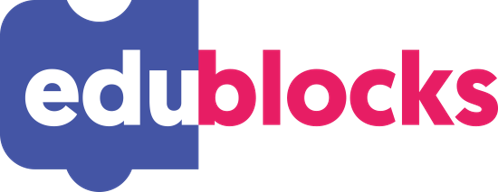

# Python-Coding-for-Kids-EduBlocks
EdBlocks, a super-simple fully icon-based programming language, is now available for use with Edison robots. A drag-and-drop block-based system, EdBlocks is intuitive and fun, even for younger users. Best of all, EdBlocks is absolutely free! 

